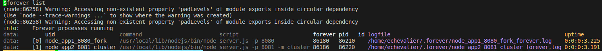
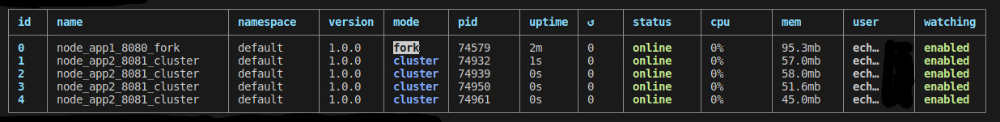
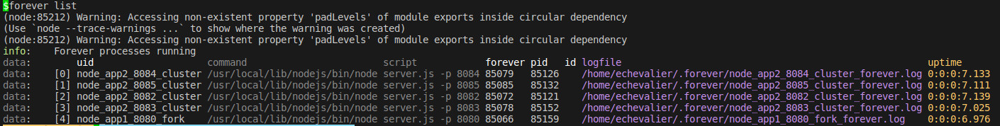
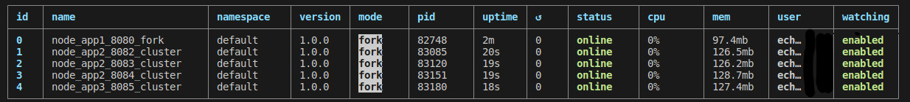

# Clase 15 - Clusters y Escalabilidad

El servidor permite el ingreso de dos parametros al ser levantado.  

    -p o --puerto para indicar el puerto

    -m o --modo con valor FORK o CLUSTER
 

Ejemplos de consultas al servidor:

    http://localhost:9090/api/login
    http://localhost:9090/api/randoms?cant=25
    http://localhost:9090/api/randoms
    http://localhost:9090/api/info

Usuario prueba Anuk con password 123456

------------------------
## Version 1 - Nginx  
------------------------  

Se desea tener un reverse proxy que escuche:  

    Puerto 8080 consultas normales como el login, info etc.

    Puerto 8081 para consultas a /api/randoms

En el puerto 8080 se va a levantar un servidor en modo Fork.
En el puerto 8081 se va a levantar un cluster de servidores con el modulo npm cluster.  

Se puede encontrar la config de nginx en la carpeta  de "nginx_config", con el nombre "code_clase15_v1"  

### **FOREVER:**  

Para levantar los servidores con FOREVER se genero una configuracion en formato json en la carpeta "forever_config",  
con el nombre en este caso "forever_config_V1.json"  

Para levantar los servires solo basta con ejecutar:  

    forever start forever_config/forever_config_V1.json

Para ver los proceso en ejecucion:  

    forever list

Para borrar todos servidores que se levantaron.

    forever stopall

### **PM2:**  

    pm2 start server.js --name="node_app1_8080_fork" --watch -- -p 8080
    pm2 start server.js --name="node_app2_8081_cluster" --watch -i max -- -p 8081

Para borrar todos servidores que se levantaron.

    pm2 delete all

------------------------
## Version 2 - Nginx 
------------------------

Se desea tener un reverse proxy que escuche:

    Puerto 8080 consultas normales como el login, info etc.
    Puerto 8082 para consultas a /api/randoms
    Puerto 8083 para consultas a /api/randoms
    Puerto 8084 para consultas a /api/randoms
    Puerto 8085 para consultas a /api/randoms

En el puerto 8080 se va a levantar un servidor en modo Fork.
En el puerto 8082 al 8085 se va a levantar un servidor en modo fork y todos para escuchar las consultas de /api/randoms

Se puede encontrar la config de nginx en la carpeta  de "nginx_config", con el nombre "code_clase15_v2"

### **FOREVER:**

Para levantar los servidores con FOREVER se genero una configuracion en formato json en la carpeta "forever_config", con el nombre en este
caso "forever_config_V2.json"

Para levantar los servires solo basta con ejecutar:

    forever start forever_config/forever_config_V2.json

Para ver los proceso en ejecucion:

    forever list

Para borrar todos servidores que se levantaron.

    forever stopall

### **PM2:**

    pm2 start server.js --name="node_app1_8080_fork" --watch -- -p 8080
    pm2 start server.js --name="node_app2_8082_cluster" --watch -- -p 8082
    pm2 start server.js --name="node_app2_8083_cluster" --watch -- -p 8083
    pm2 start server.js --name="node_app2_8084_cluster" --watch -- -p 8084
    pm2 start server.js --name="node_app3_8085_cluster" --watch -- -p 8085

Para borrar todos servidores que se levantaron.

    pm2 delete all

